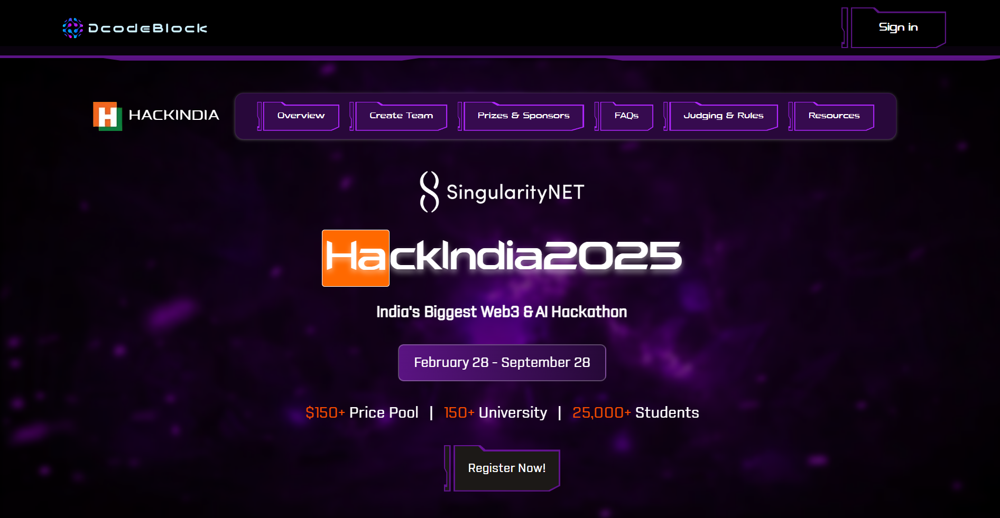

# Figma Clone 🎨

🚀 A simple Figma-like design tool built using **React** and **Tailwind CSS**. This project was developed as part of an assessment at **DcodeBlock**.

## 🔗 Live Demo

Check out the live version here: [Figma Clone](https://hackathon-assignment-eight.vercel.app/)

## 🖼️ Screenshot  
  

## 🛠️ Technologies Used

- **React.js** ⚛️ – For building the user interface
- **Tailwind CSS** 🎨 – For styling and responsiveness

## ✨ Features

- Basic Figma-like UI
- Drag & drop elements
- Intuitive design panel
- Responsive layout

## 📂 Installation & Setup

To run this project locally, follow these steps:

1. **Clone this repository:**

   ```sh
   git clonehttps://github.com/MohammadAsad-Weber/hackathon-assignment.git
   ```

2. **Navigate to the project directory:**

   ```sh
   cd figma-clone
   ```

3. **Install dependencies:**

   ```sh
   npm install
   ```

4. **Start the development server:**

   ```sh
    npm run dev
   ```

5. **Open your browser and visit:**

   ```sh
    http://localhost:5173/
   ```

## 📜 License

This project was developed for assessment purposes at DcodeBlock.
